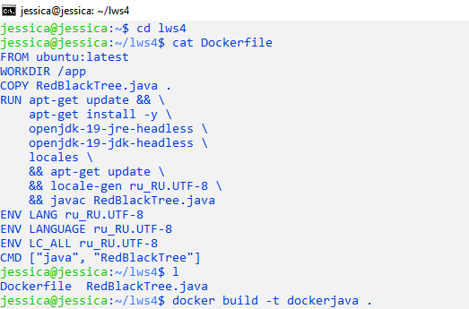
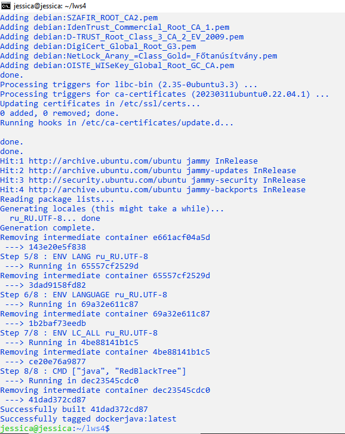
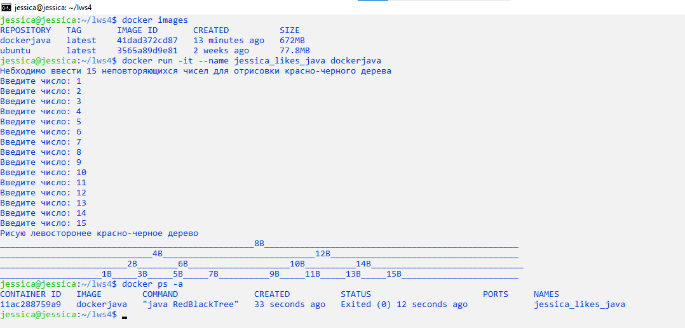

# Containerization. Workshop 4. Homework. Тогочакова Евгения. 4544
# Dockerfile и слои 
## Задание: необходимо создать Dockerfile, основанный на любом образе (вы вправе выбрать самостоятельно). В него необходимо поместить приложение, написанное на любом известном вам языке программирования (Python, Java, C, С#, C++). При запуске контейнера должно запускаться самостоятельно написанное приложение.
```
jessica@jessica:~$ cd lws4  
jessica@jessica:~/lws4$ cat Dockerfile
jessica@jessica:~/lws4$ l
jessica@jessica:~/lws4$ docker build -t dockerjava .  
```




```
jessica@jessica:~/lws4$ docker images 
jessica@jessica:~/lws4$ docker run -it --name jessica_likes_java dockerjava 
jessica@jessica:~$ docker ps -a
```
